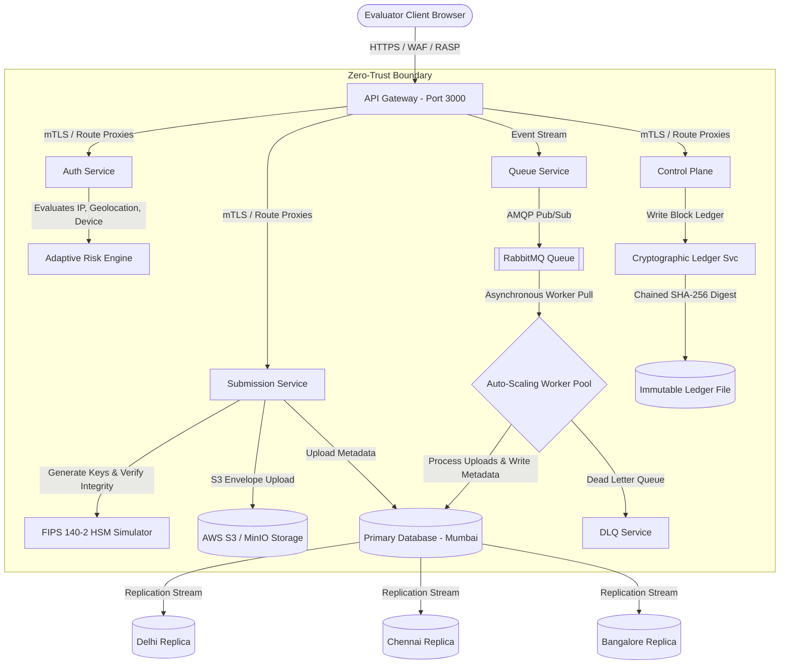

# 🚀 EvalSync Enterprise Security 6.0 — Secure Academic Evaluation Gateway for CBSE

<div align="center">

_**"Distributed Microservices System Architecture & Zero-Trust Security Ledger for High-Traffic Board Examination Evaluation Portals"**_

[](LICENSE)
[](https://nodejs.org)
[](tests/server.test.js)
[](package.json)
[](Dockerfile)
[](k8s/deployment.yaml)

[Live Demo Preview](https://rishisharma029.github.io/EvalSync-System/) • [GitHub Repository](https://github.com/Rishisharma029/EvalSync-System) • [Developer Portfolio](https://github.com/Rishisharma029)

</div>

---

## 📌 Project Overview

**EvalSync Enterprise 6.0** is a production-grade, highly secure, and containerized academic evaluation portal designed to handle high-traffic board examination environments (such as CBSE) at a nationwide scale. 

During peak evaluation periods, thousands of academic evaluators upload high-resolution scanned answer scripts simultaneously. Traditional database-coupled gateways crash under these load spikes due to connection pool exhaustion and memory overflows. 

EvalSync addresses this with a **decoupled distributed queue architecture** combined with a **Zero-Trust Security Framework** to protect sensitive student records against advanced persistent threats (APTs), insider collation attacks, and automated brute-force scripts.

---

## 🏗️ System Architecture

EvalSync operates in a **dual-mode configuration**:
1. **Monolithic In-Process Router Mode:** Fits seamlessly in Jest test suites and local lightweight development runs.
2. **Distributed Microservices Ingress Mode:** Runs as 11 decoupled microservices communicating through mTLS, utilizing Redis caching and RabbitMQ messaging, orchestrated via Kubernetes.

### 🌐 Distributed System Architecture Diagram



---

## 🛡️ Enterprise Security 6.0 Features

EvalSync's Zero-Trust design implements enterprise-grade layers to secure every aspect of the examination evaluation cycle:

### 1. Web Application Firewall (WAF) & RASP Gateway Filters
The gateway hosts a real-time parsing engine inspecting incoming request payloads before they reach business routers:
*   **SQL Injection (SQLi) Blockers:** Detects and denies patterns matching `' OR 1=1`, database comment codes (`' --`), and query unions.
*   **Stored XSS Defenses:** Automatically neutralizes HTML `<script>` tags, event handlers (`onerror=`, `onload=`), and script execution functions.
*   **Path Traversal Prevention:** Rejects relative path segments (`../`) and system file paths (`/etc/passwd`).
*   **SIEM Event Log Normalization:** Formats blocked incidents in Common Event Format (CEF) for direct security log ingestion.

### 2. Adaptive Authentication Risk Engine
Login endpoints evaluate multiple risk telemetry layers to adjust authentication requirements dynamically:
*   **Impossible Travel Detection:** Evaluates consecutive login timestamps and geolocations to check if the distance speed vector is physically impossible.
*   **Device Fingerprinting:** Flags browser reputation, OS mismatches, and bot user agents.
*   **Progressive Login Lockouts:** Suspends account access for 15 minutes after 5 consecutive failures, adding exponential response delays.
*   **8 Role RBAC Support:** Granular access controls mapping Evaluator, Moderator, Admin, Super Admin, Monitor, Auditor, Regional Admin, and API Client tokens.

### 3. FIPS-Compliant HSM Envelope Encryption & DLP
*   **HSM Signature Creation:** Scanned answer scripts are signed using a simulated Hardware Security Module (FIPS 140-2 key architecture) to guarantee non-repudiation.
*   **Data Loss Prevention (DLP):** Rejects bulk downloads, limiting active sessions to a maximum of 5 script downloads to prevent database scrapers.
*   **Expiring Signed URLs:** Document retrieval requests generate short-lived signed tokens containing expiration nonces and client hashes.

### 4. Immutable Cryptographic Ledger Chain
All configuration settings and threat incidents append to a tamper-evident cryptographic ledger:
*   Each block is chained via `SHA-256(BlockIndex | Timestamp | Role | Action | Details | Status | PreviousBlockHash)`.
*   Any unauthorized tampering with the ledger file invalidates the digest sequence, alerting audit monitors immediately.

---

## 🔬 Red Team Attack Simulation Console

EvalSync features an interactive **Executive SOC (Security Operations Center) Dashboard** and an integrated **Red Team Simulation Center**. 

Administrators can simulate common exploits to verify that gateway defenses intercept, log, and contain threat vectors in real-time:
*   **💉 SQL Injection:** Submits raw injection patterns to test WAF blocking.
*   **🖥️ Stored XSS:** Inject script tags into form parameters.
*   **🔄 CSRF Tampering:** Triggers state changes without token validation.
*   **🔑 JWT Signature forgery:** Emulates tampering with session tokens.
*   **🔓 Brute Force:** Generates high-frequency authentication attempts.
*   **📤 DLP Leakage:** Attempts bulk file downloads.

```text
               [EXPLOT SIMULATION TRIGGERED]
                            │
                            ▼
        ┌───────────────────────────────────────┐
        │  WAF/RASP Gateway Parsing Filter      │
        └───────────────────┬───────────────────┘
                            ├────────────────────────┐
                 [Matches Block Rules]     [No Violations]
                            │                        │
                            ▼                        ▼
        ┌───────────────────────────────────────┐   ┌─────────────────┐
        │ 🚨 exploit blocked, 403 Forbidden     │   │ Process Request │
        │ - Generate CEF alert payload          │   └─────────────────┘
        │ - Securely append to Cryptographic    │
        │   ledger chain block                  │
        │ - Decrement SOC Security Score        │
        │ - Increment Blocked Threat Telemetry  │
        └───────────────────────────────────────┘
```

---

## 📂 Project Structure

```text
evalsync/
 ├── services/                    # Decoupled Microservice Logic
 │    ├── api-gateway/            # Central request proxying & mTLS simulation
 │    ├── auth-service/           # Adaptive Auth risk checks, lockout controls, RBAC
 │    ├── submission-service/     # FIPS HSM signing, S3 upload, DLP download constraints
 │    ├── audit-service/          # Tamper-evident cryptographic ledger chain
 │    ├── control-plane/          # Disaster Recovery, Feature Flags, Attack Simulation
 │    └── gateway/                # WAF / RASP middleware filter definitions
 ├── k8s/                         # Kubernetes Deployment Manifests
 │    └── deployment.yaml         # Configures Ingress, HPAs, Services, and Pod limits
 ├── tests/
 │    └── server.test.js          # Jest + Supertest integration security test suite
 ├── Dockerfile                   # Hardened multi-stage container configuration
 ├── docker-compose.yml           # Dev environment launcher (Redis + RabbitMQ + App)
 ├── server.js                    # Core entrypoint mounting monolithic / microservice routes
 ├── index.html                   # Glassmorphic single-page app containing SOC Dashboard
 ├── style.css                    # Visual stylesheets housing SOC controls
 ├── app.js                       # Frontend app shell binding telemetry & simulators
 ├── .env.example                 # Configuration variables template
 └── audit.log                    # Local persistence of audited actions
```

---

## 🚀 Installation & Execution

### 1. Local Setup
Ensure [Node.js v20.x](https://nodejs.org) is installed on your system.

```bash
# Clone the repository
git clone https://github.com/Rishisharma029/EvalSync-System.git
cd EvalSync-System

# Install precise dependencies
npm install

# Set up local environment variables
cp .env.example .env
```

### 2. Environment Configuration (`.env`)
Create a `.env` file in the root directory. You can customize the blowfish `$2b$` bcrypt hashes to match your credentials:

```properties
PORT=3000
SESSION_SECRET=dev_session_secret_replace_this_in_production

# Pre-hashed passwords (plain values: CBSE@2024, Admin@2024, SuperAdmin@2024, Monitor@2024)
EVALUATOR_PASSWORD_HASH=$2b$10$z2QmXa7f9tSsmGfenpp48.5dhCr43kNG0NR4fOBpNj7z0xNCYgPla
ADMIN_PASSWORD_HASH=$2b$10$Nti5yGJgLBjUyS8rROTP5OAkvWbdO8pwK2MleV25NNGaJB2o2/j.O
SUPERADMIN_PASSWORD_HASH=$2b$10$Rfr2lahJKlVkTWDN.cgOCOAVVwFDzL7AfO8AH86eFot3IHFX9lPtK
MONITOR_PASSWORD_HASH=$2b$10$QZ7OwANRRlkFm8Pq47Tz3uake3lMpnEAnfxjMVFhupFWXwTLSf9/O
```

### 3. Start the Server
```bash
npm start
```
Open `http://localhost:3000` in your web browser.

> [!NOTE]
> **Static Browser Fallback:** EvalSync supports offline mode. If you double-click `index.html` directly from your hard drive (`file://` protocol), the client automatically bypasses backend server requirements and executes simulated authentication, keeping the portfolio fully interactive without starting Node.js.

---

## 🐳 Container & Cluster Deployment

### Docker Compose Dev Stack
To spin up EvalSync integrated with a local Redis caching container and RabbitMQ message broker:
```bash
docker compose up -d --build
```

### Kubernetes Production Cluster
Kubernetes configurations are available inside `k8s/deployment.yaml`. Apply the deployment to your cluster:
```bash
kubectl apply -f k8s/deployment.yaml
```
The manifest deploys:
- **Horizontal Pod Autoscaling (HPA):** Scales pods dynamically between 3 and 12 based on average CPU utilization exceeding 80%.
- **Ingress Controller:** Rules handling secure mTLS endpoint forwarding.
- **Resource Constraints:** Enforces standard memory limits (Max: 512Mi) and CPU limits (Max: 500m) to mitigate denial-of-service node exhaustion.

---

## 🧪 Testing & Validation

Run the Jest integration suite to verify session management, rate limits, Helmet configurations, and WAF blocks:
```bash
# Run tests
npm test

# Run test coverage
npm run test:coverage
```

---

## 📄 License

This project is licensed under the MIT License - see the [LICENSE](LICENSE) file for details.
